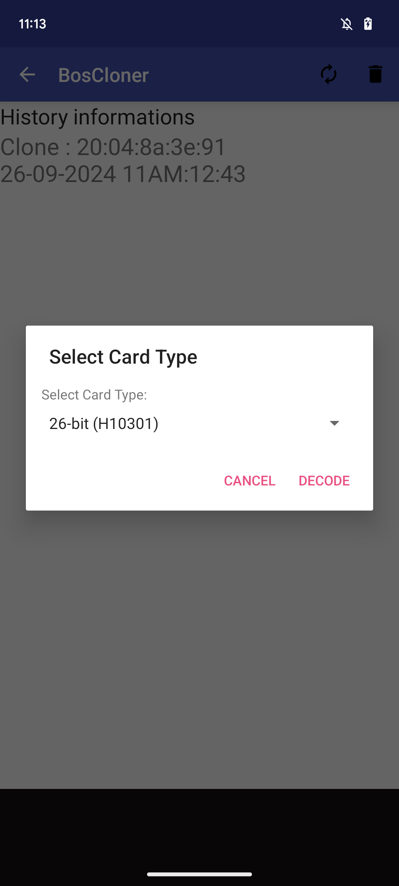
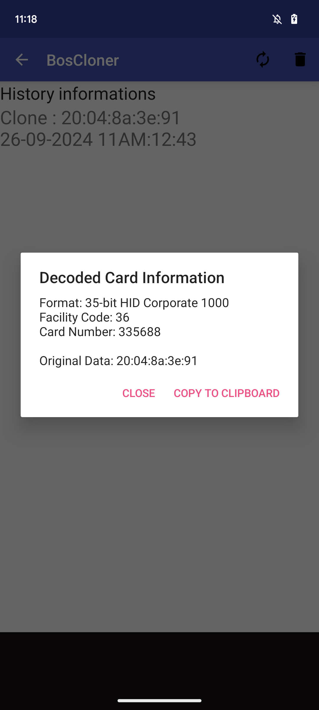

# BosCloner
Updated + Improved app for BosCloner

This app is based on the v1.1 version of BosCloner that supports modern BLE hardware. 

## Improvements
To make the cloner more compatible with other cloning tools, the history page has been modified to now display the facility code and card number via decoding the hex dump sent from the boscloner.

